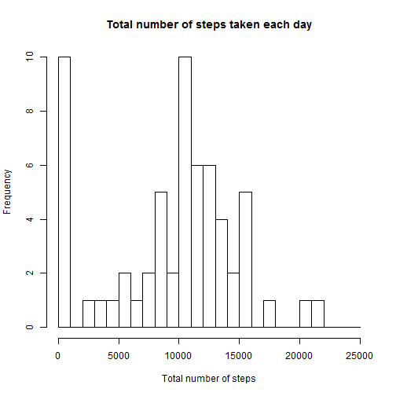
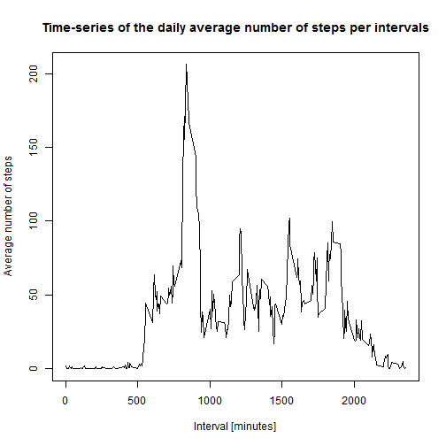
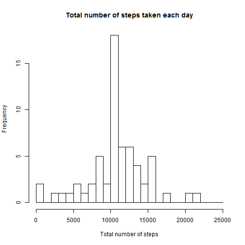
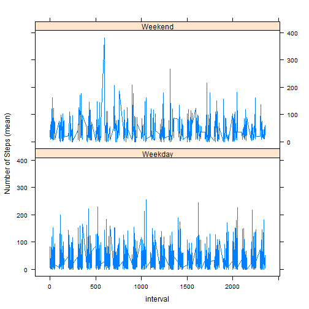

## Loading and preprocessing the data

#### 1. Load the data

Load the activity data by unzipping the activity.zip file into a table. The activity.zip file   will be in current directory.


```r
activity <- read.table(unz("activity.zip", "activity.csv"), header=T, quote="\"", sep=",")
```

#### 2. Process/transform the data (if necessary) into a format suitable for your analysis

Transform the activity data. Add a column representing the day name based on date. This will be later used for further analysis.

```r
activity$date <- as.Date(activity$date)
activity$weekday <- weekdays(activity$date)
```

Take a look at transformed activity data - head and tail.

```r
head(activity, 3)
```

```
##   steps       date interval weekday
## 1    NA 2012-10-01        0  Monday
## 2    NA 2012-10-01        5  Monday
## 3    NA 2012-10-01       10  Monday
```

```r
tail(activity, 3)
```

```
##       steps       date interval weekday
## 17566    NA 2012-11-30     2345  Friday
## 17567    NA 2012-11-30     2350  Friday
## 17568    NA 2012-11-30     2355  Friday
```

## What is mean total number of steps taken per day?

#### 1. Calculate the total number of steps taken per day.
#### 2. Make a histogram of the total number of steps taken each day.

Aggregate by date and calculate sum of steps by each date. Display the historgram of the Total number of steps taken per day.


```r
stepsPerDay <- aggregate(activity$steps, by=list(activity$date), FUN=sum, na.rm=TRUE)

hist(stepsPerDay$x, breaks=seq(from=0, to=25000, by=1000), 
     xlab="Total number of steps", main="Total number of steps taken each day")
```

 

#### 3. Calculate and report the mean and median of the total number of steps taken per day

Mean and Medain of the Total number of steps taken per day.

```r
mean(stepsPerDay$x)
```

```
## [1] 9354.23
```

```r
median(stepsPerDay$x)
```

```
## [1] 10395
```

#### The mean of stpes taken per day is 9354 and median for the same is 10395

## What is the average daily activity pattern?

#### 1. Make a time series plot (i.e. type = "l") of the 5-minute interval (x-axis) and the average number of steps taken, averaged across all days (y-axis)

Get the avergae steps per each day by aggregating it by time interval.


```r
avgStepsPerDayByInterval <- aggregate(activity$steps, by=list(activity$interval), 
                                      FUN=mean, na.rm=TRUE)
names(avgStepsPerDayByInterval) <- c("interval", "averageStepsPerDay")
plot(avgStepsPerDayByInterval$interval, 
        avgStepsPerDayByInterval$averageStepsPerDay, 
        type="l", 
        xlab="Interval [minutes]", 
        ylab="Average number of steps", 
        main="Time-series of the daily average number of steps per intervals")
```

 

#### 2. Which 5-minute interval, on average across all the days in the dataset, contains the maximum number of steps?

Get the maximum number of steps.


```r
avgStepsPerDayByInterval[which.max(avgStepsPerDayByInterval$averageStepsPerDay), ]
```

```
##     interval averageStepsPerDay
## 104      835           206.1698
```
####The interval 835 (for 5 minutes intervals) contains the maximum numbmer of steps.

## Imputing missing values

#### 1. Calculate and report the total number of missing values in the dataset (i.e. the total number of rows with NAs)

```r
sum(is.na(activity$steps))
```

```
## [1] 2304
```
####The total number of rows with missing steps values in the dataset is 2304. 

#### 2. Devise a strategy for filling in all of the missing values in the dataset.
#### 3. Create a new dataset that is equal to the original dataset but with the missing data filled in.  
We will create a new dataset as copy of activity dataset. To identify the value to fill up missing (NA) data, we will reuse the "avgStepsPerDayByInterval" obtained in above calculation. We will merge it to add a new column for every entry 'steps' in the original, with the merge key the 'interval'. We will replace the original NA values in steps column with corresponding new value from averageStepsPerDay. And we will remove the column averageStepsPerDay after that as it is not needed.


```r
activityNew <- activity
activityNew <- merge(activityNew, avgStepsPerDayByInterval, by = "interval")
activityNew$steps[is.na(activityNew$steps)] <- activityNew$averageStepsPerDay[is.na(activityNew$steps)]
activityNew$averageStepsPerDay = NULL
```
#### 4. Make a histogram of the total number of steps taken each day and Calculate and report the mean and median total number of steps taken per day. Do these values differ from the estimates from the first part of the assignment? What is the impact of imputing missing data on the estimates of the total daily number of steps?

We will use this new activity dataset to recalculate the total steps taken per day same as we did above. And display a new histogram.


```r
stepsPerDayNew <- aggregate(activityNew$steps, by=list(activityNew$date), FUN=sum, na.rm=TRUE)
 hist(stepsPerDayNew$x, breaks=seq(from=0, to=25000, by=1000), 
        xlab="Total number of steps", main="Total number of steps taken each day")
```

 

Calculate new Mean and Medain of the Total number of steps taken per day.

```r
mean(stepsPerDayNew$x)
```

```
## [1] 10766.19
```

```r
median(stepsPerDayNew$x)
```

```
## [1] 10766.19
```
####The new mean and median values for the total number of steps taken per day is 10766.


## Are there differences in activity patterns between weekdays and weekends?

#### 1. Create a new factor variable in the dataset with two levels - "weekday" and "weekend" indicating whether a given date is a weekday or weekend day.
#### 2. Make a panel plot containing a time series plot (i.e. type = "l") of the 5-minute interval (x-axis) and the average number of steps taken, averaged across all weekday days or weekend days (y-axis).

Using the dataset activityNew, first identify type-of-day for given weekday names. Aggregate mean of number steps by interval for type of day. Use this to make a panel plot for weekend and weekdays.


```r
library(lattice)
activityNew$typeOfDay <- ifelse(activityNew$weekday == "Saturday" | 
                                    activityNew$weekday == "Sunday", "Weekend", "Weekday")
activityNewPlot <- aggregate(activityNew$steps, 
                             by=list(activityNew$typeOfDay, 
                                     activityNew$weekday, activity$interval), mean)
names(activityNewPlot) <- c("typeOfDay", "weekday", "interval", "meanSteps")
xyplot(meanSteps ~ interval | typeOfDay, type = "l", 
       lwd = 1, data = activityNewPlot, layout = c(1,2), ylab = "Number of Steps (mean)")
```

 

#### Looking at the Y-axis, the plots for weekend and weekday indicates that there is more activity during the weekend.

## End of Report
